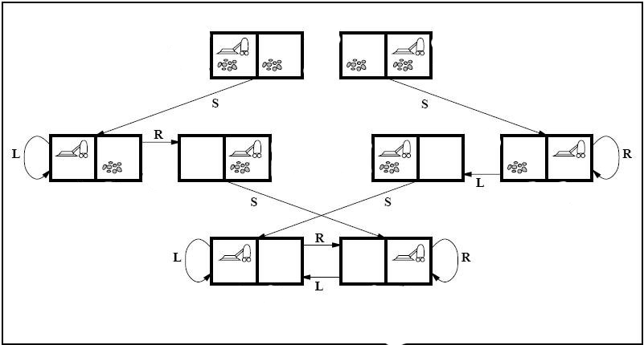
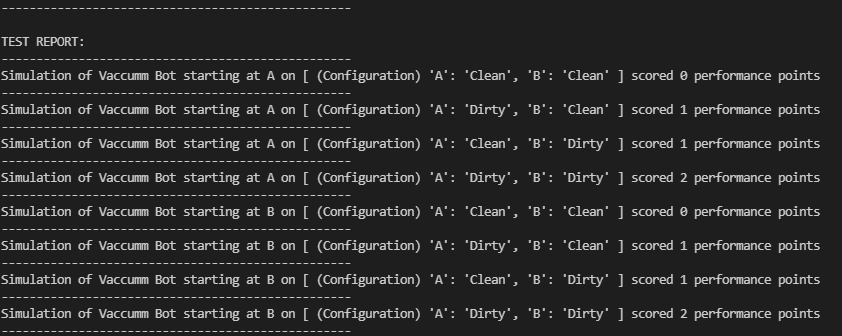
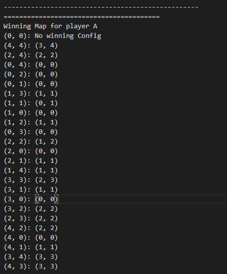
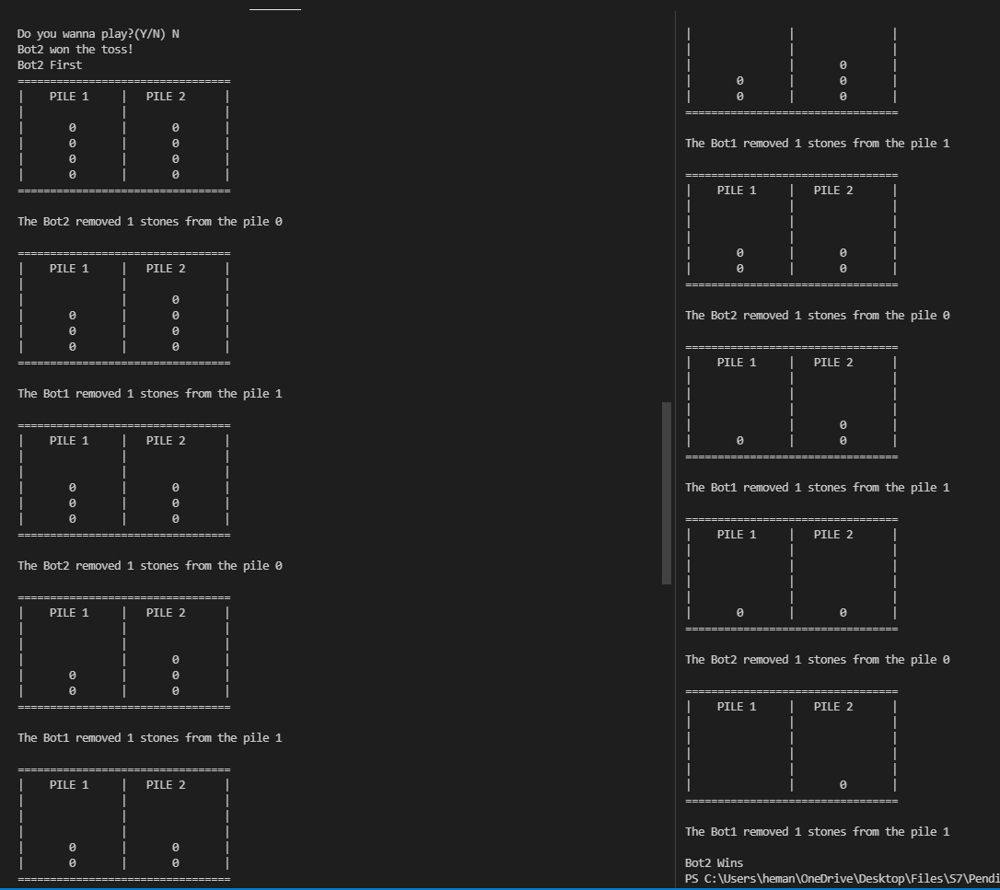
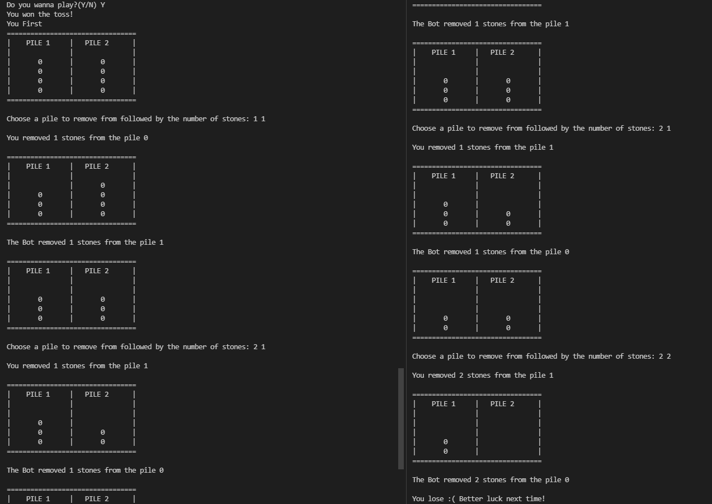
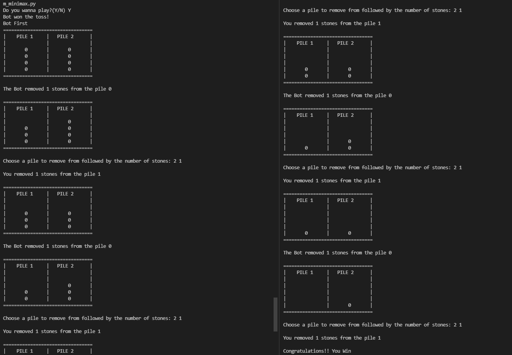

# AI-Assignment-Oct2021
<br>
This project is an implementation of AI-based agents <br>

* VaccuumBot    - A simple reflex agent
* NimBot        - A rational agent utilizing minimax algorithm
<br>
<br>

## Vaccuum Bot
The environment consists of 2 blocks: A and B which can hold the status of Clean or Dirty.<br>
The agent is a vacuum bot which decides its action based on the status of the location:<br>
1. If the location is Dirty, the agent cleans the location<br>
2. If the location is Clean, the agent moves randomly in any direction<br>
If the bot hits a wall, it remains in the same location, else it moves to the other block.<br>
<br>
Each action is considered as a time step. A performance measure of the agent,  the number of cleaned locations is measured upon each time step.<br> 
After a lifetime of 1000 timesteps, the agent is terminated and the performance is measured.<br>
This simulation is repeated on all possible configurations to understand the performance of the agent.<br>
<br>
The state space graph is shown below:<br>
<br>
<br>
Configurations from the simulation run are shown below:<br>
<br>

## How to Use:
Run the script using ```python .\q1_simplex_reflex_agent_simulation.py```<br>
The simulations will run and report will be generated for the test runs<br>
The simulation call can also be modified to accomodate changes to lifetime and to show action report for each timestep<br>
<br>

## Nim Bot
The game space consists of 2 piles of stones, each having a equal number of stones initially.<br>
The game rules are as follows:<br>
1. A player can remove any number of stones from any pile.<br>
2. The player who has to remove the last stone loses the game<br>
<br>

The agent is a Nim bot which decides its action based on the number of stones in the piles using the minimax algorithm.<br>
An evaluation score is decided based on who won the game.<br>
A map is computed from the game that the bot plays with another bot, created using the minimax algorithm with the initial evaluation score on the leaf nodes.<br>
The bot is then able to play the game against the humans or other bots using the map.<br>
The winning map after training over the minimax is as follows:<br>
<br>
<br>
The output of the bot vs bot game played is shown below:<br>
<br>
<br>
The output of the Human vs bot game 1 played is shown below:<br>
<br>
<br>
The output of the bot vs bot game 2 played is shown below:<br>
<br>
## How to Use:
Run the script using ```python .\q2.py_nim_minimax.py```<br>
Decide if a human wants to play with the bot or not<br>
A game will be initiated and a coin toss decides who goes first<br>
A sequence of inputs for pile no. and number of stones will be requested on the console for input<br>
The game tree will be displayed after every move<br>
Winning will be declared when the stack reaches [0, 0] or if the bot concedes(No giving up for the user!!)<br>
